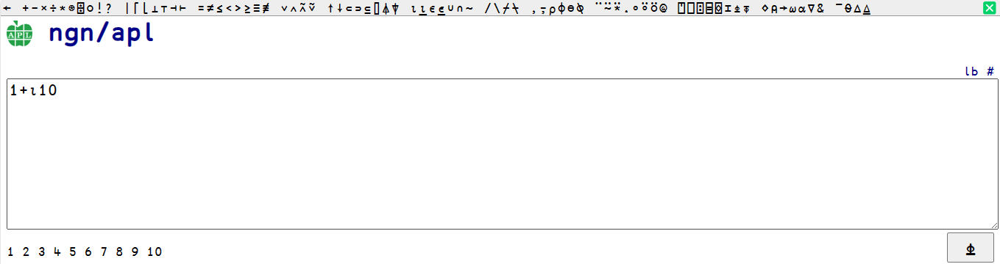

**This is an archive of ngn/apl but PRs to this repo are still accepted. Feel free to contribute!**

Its author thinks it has served its purpose and has become a distraction. He went on to create a free [implementation](https://codeberg.org/ngn/k) of [K6](https://en.wikipedia.org/wiki/K_(programming_language)) and encouraged people to use that instead, until he stopped supporting that too.

----

[Online Demo](https://abrudz.github.io/ngn-apl) - can also be installed offline as a [PWA (Progressive Web App)](https://developer.mozilla.org/en-US/docs/Web/Progressive_web_apps/Guides/What_is_a_progressive_web_app) on a computer / phone - even without internet!

An [APL](https://aplwiki.com) interpreter written in JavaScript.
Runs in a browser or [NodeJS](https://nodejs.org/).

Supports: most primitives, dfns (`{⍺ ⍵}`), nested arrays, complex numbers (`1j2`), infinities (`¯` or `∞`), forks and
atops, strand assignment (`(a b)←c`), indexed assignment (`a[b]←c`), user-defined operators (`{⍺⍺ ⍵⍵}`).

Doesn't support: tradfns (`∇R←X f Y`), non-zero index origin (`⎕IO`), comparison tolerance (`⎕CT`),
prototypes, modified assignment (`x+←1`), control structures (`:If`), object-oriented features, namespaces.

Used in [Paul L Jackson's web site](https://plj541.github.io/APL.js/), [repl.it](https://repl.it/languages/APL),
and [tio.run](https://tio.run/#apl-ngn).

# Offline usage with NodeJS

Run `apl.js` with [Node](https://nodejs.org/) to start a REPL:

    node apl.js

An APL script can be given as argument:

    node apl.js filename.apl

`apl.js` can be `require()`d as a CommonJS module from JavaScript:

    var apl=require('./apl')
    var r=apl('1 2 3+4 5 6')

or used in an HTML page:

    
    

# Editor support

* [Vim keymap and syntax](https://gitlab.com/n9n/vim-apl)
* [baruchel/vim-notebook](https://github.com/baruchel/vim-notebook): evaluate blocks of APL code in a vim buffer
